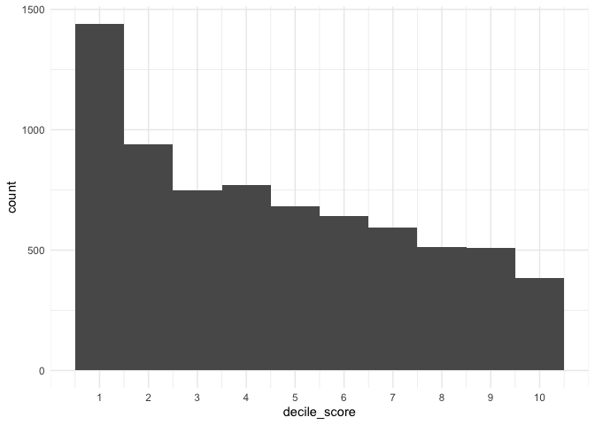
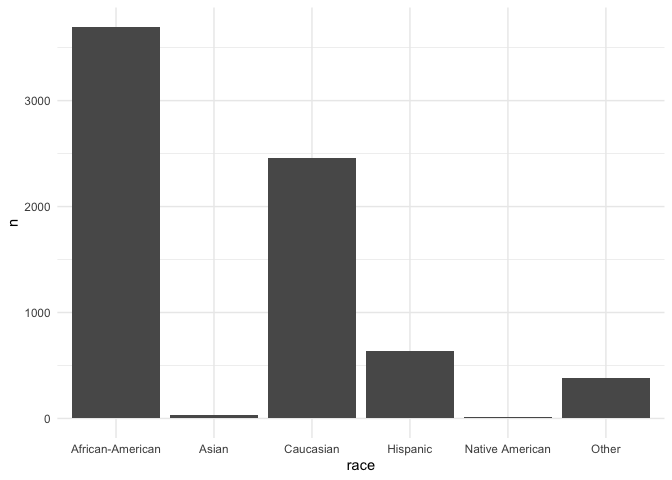
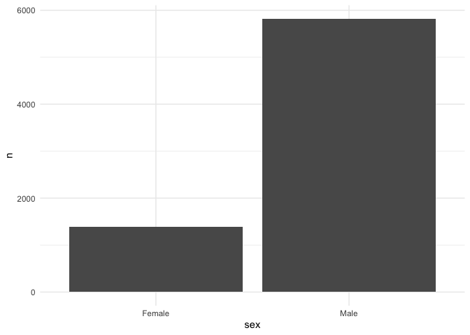
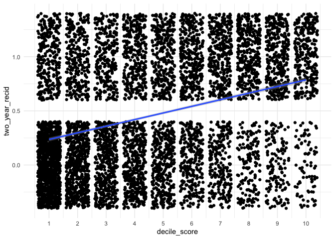
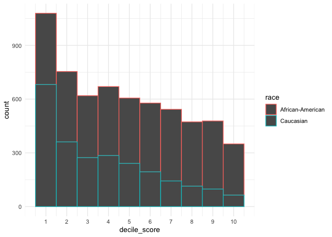
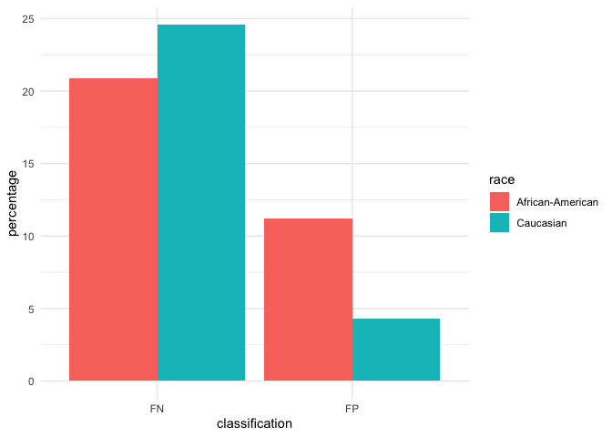
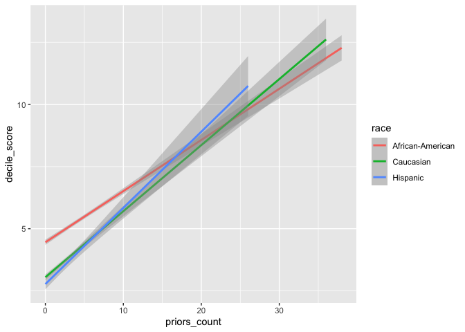
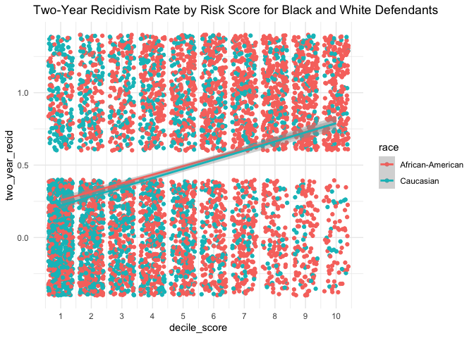
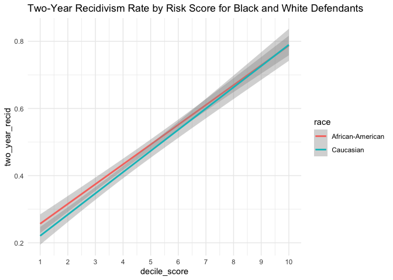

Lab 09: Algorithmic Bias
================
Noah Booker
5/3/25

## Load Packages and Data

First, let’s load the necessary packages:

``` r
library(tidyverse)
library(janitor)
library(fairness)
```

### The data

For this lab, we’ll use the COMPAS dataset compiled by ProPublica. The
data has been preprocessed and cleaned for you. You’ll have to load it
yourself. The dataset is available in the `data` folder, but I’ve
changed the file name from `compas-scores-two-years.csv` to
`compas-scores-2-years.csv`. I’ve done this help you practice debugging
code when you encounter an error.

``` r
compas <- read_csv("data/compas-scores-2-years.csv") %>%
  clean_names() %>%
  rename(
    decile_score = decile_score_12,
    priors_count = priors_count_15
  )
```

    ## New names:
    ## Rows: 7214 Columns: 53
    ## ── Column specification
    ## ──────────────────────────────────────────────────────── Delimiter: "," chr
    ## (19): name, first, last, sex, age_cat, race, c_case_number, c_charge_de... dbl
    ## (19): id, age, juv_fel_count, decile_score...12, juv_misd_count, juv_ot... lgl
    ## (1): violent_recid dttm (2): c_jail_in, c_jail_out date (12):
    ## compas_screening_date, dob, c_offense_date, c_arrest_date, r_offe...
    ## ℹ Use `spec()` to retrieve the full column specification for this data. ℹ
    ## Specify the column types or set `show_col_types = FALSE` to quiet this message.
    ## • `decile_score` -> `decile_score...12`
    ## • `priors_count` -> `priors_count...15`
    ## • `decile_score` -> `decile_score...40`
    ## • `priors_count` -> `priors_count...49`

``` r
# Take a look at the data
glimpse(compas)
```

    ## Rows: 7,214
    ## Columns: 53
    ## $ id                      <dbl> 1, 3, 4, 5, 6, 7, 8, 9, 10, 13, 14, 15, 16, 18…
    ## $ name                    <chr> "miguel hernandez", "kevon dixon", "ed philo",…
    ## $ first                   <chr> "miguel", "kevon", "ed", "marcu", "bouthy", "m…
    ## $ last                    <chr> "hernandez", "dixon", "philo", "brown", "pierr…
    ## $ compas_screening_date   <date> 2013-08-14, 2013-01-27, 2013-04-14, 2013-01-1…
    ## $ sex                     <chr> "Male", "Male", "Male", "Male", "Male", "Male"…
    ## $ dob                     <date> 1947-04-18, 1982-01-22, 1991-05-14, 1993-01-2…
    ## $ age                     <dbl> 69, 34, 24, 23, 43, 44, 41, 43, 39, 21, 27, 23…
    ## $ age_cat                 <chr> "Greater than 45", "25 - 45", "Less than 25", …
    ## $ race                    <chr> "Other", "African-American", "African-American…
    ## $ juv_fel_count           <dbl> 0, 0, 0, 0, 0, 0, 0, 0, 0, 0, 0, 0, 0, 0, 0, 0…
    ## $ decile_score            <dbl> 1, 3, 4, 8, 1, 1, 6, 4, 1, 3, 4, 6, 1, 4, 1, 3…
    ## $ juv_misd_count          <dbl> 0, 0, 0, 1, 0, 0, 0, 0, 0, 0, 0, 0, 0, 0, 0, 0…
    ## $ juv_other_count         <dbl> 0, 0, 1, 0, 0, 0, 0, 0, 0, 0, 0, 0, 0, 0, 0, 0…
    ## $ priors_count            <dbl> 0, 0, 4, 1, 2, 0, 14, 3, 0, 1, 0, 3, 0, 0, 1, …
    ## $ days_b_screening_arrest <dbl> -1, -1, -1, NA, NA, 0, -1, -1, -1, 428, -1, 0,…
    ## $ c_jail_in               <dttm> 2013-08-13 06:03:42, 2013-01-26 03:45:27, 201…
    ## $ c_jail_out              <dttm> 2013-08-14 05:41:20, 2013-02-05 05:36:53, 201…
    ## $ c_case_number           <chr> "13011352CF10A", "13001275CF10A", "13005330CF1…
    ## $ c_offense_date          <date> 2013-08-13, 2013-01-26, 2013-04-13, 2013-01-1…
    ## $ c_arrest_date           <date> NA, NA, NA, NA, 2013-01-09, NA, NA, 2013-08-2…
    ## $ c_days_from_compas      <dbl> 1, 1, 1, 1, 76, 0, 1, 1, 1, 308, 1, 0, 0, 1, 4…
    ## $ c_charge_degree         <chr> "F", "F", "F", "F", "F", "M", "F", "F", "M", "…
    ## $ c_charge_desc           <chr> "Aggravated Assault w/Firearm", "Felony Batter…
    ## $ is_recid                <dbl> 0, 1, 1, 0, 0, 0, 1, 0, 0, 1, 0, 1, 0, 0, 1, 1…
    ## $ r_case_number           <chr> NA, "13009779CF10A", "13011511MM10A", NA, NA, …
    ## $ r_charge_degree         <chr> NA, "(F3)", "(M1)", NA, NA, NA, "(F2)", NA, NA…
    ## $ r_days_from_arrest      <dbl> NA, NA, 0, NA, NA, NA, 0, NA, NA, 0, NA, NA, N…
    ## $ r_offense_date          <date> NA, 2013-07-05, 2013-06-16, NA, NA, NA, 2014-…
    ## $ r_charge_desc           <chr> NA, "Felony Battery (Dom Strang)", "Driving Un…
    ## $ r_jail_in               <date> NA, NA, 2013-06-16, NA, NA, NA, 2014-03-31, N…
    ## $ r_jail_out              <date> NA, NA, 2013-06-16, NA, NA, NA, 2014-04-18, N…
    ## $ violent_recid           <lgl> NA, NA, NA, NA, NA, NA, NA, NA, NA, NA, NA, NA…
    ## $ is_violent_recid        <dbl> 0, 1, 0, 0, 0, 0, 0, 0, 0, 1, 0, 0, 0, 0, 0, 0…
    ## $ vr_case_number          <chr> NA, "13009779CF10A", NA, NA, NA, NA, NA, NA, N…
    ## $ vr_charge_degree        <chr> NA, "(F3)", NA, NA, NA, NA, NA, NA, NA, "(F2)"…
    ## $ vr_offense_date         <date> NA, 2013-07-05, NA, NA, NA, NA, NA, NA, NA, 2…
    ## $ vr_charge_desc          <chr> NA, "Felony Battery (Dom Strang)", NA, NA, NA,…
    ## $ type_of_assessment      <chr> "Risk of Recidivism", "Risk of Recidivism", "R…
    ## $ decile_score_40         <dbl> 1, 3, 4, 8, 1, 1, 6, 4, 1, 3, 4, 6, 1, 4, 1, 3…
    ## $ score_text              <chr> "Low", "Low", "Low", "High", "Low", "Low", "Me…
    ## $ screening_date          <date> 2013-08-14, 2013-01-27, 2013-04-14, 2013-01-1…
    ## $ v_type_of_assessment    <chr> "Risk of Violence", "Risk of Violence", "Risk …
    ## $ v_decile_score          <dbl> 1, 1, 3, 6, 1, 1, 2, 3, 1, 5, 4, 4, 1, 2, 1, 2…
    ## $ v_score_text            <chr> "Low", "Low", "Low", "Medium", "Low", "Low", "…
    ## $ v_screening_date        <date> 2013-08-14, 2013-01-27, 2013-04-14, 2013-01-1…
    ## $ in_custody              <date> 2014-07-07, 2013-01-26, 2013-06-16, NA, NA, 2…
    ## $ out_custody             <date> 2014-07-14, 2013-02-05, 2013-06-16, NA, NA, 2…
    ## $ priors_count_49         <dbl> 0, 0, 4, 1, 2, 0, 14, 3, 0, 1, 0, 3, 0, 0, 1, …
    ## $ start                   <dbl> 0, 9, 0, 0, 0, 1, 5, 0, 2, 0, 0, 4, 1, 0, 0, 0…
    ## $ end                     <dbl> 327, 159, 63, 1174, 1102, 853, 40, 265, 747, 4…
    ## $ event                   <dbl> 0, 1, 0, 0, 0, 0, 1, 0, 0, 1, 0, 1, 0, 0, 1, 1…
    ## $ two_year_recid          <dbl> 0, 1, 1, 0, 0, 0, 1, 0, 0, 1, 0, 1, 0, 0, 1, 1…

## Part 1: Exploring the data

### Exercise 1

> What are the dimensions of the COMPAS dataset? (Hint: Use inline R
> code and functions like nrow and ncol to compose your answer.) What
> does each row in the dataset represent? What are the variables?

``` r
compas %>% 
  nrow()
```

    ## [1] 7214

``` r
compas %>% 
  ncol()
```

    ## [1] 53

The COMPAS dataset has 7,214 rows and 15 columns. Each row represents a
defendant. There are 53 variables, some containing demographic
information about the defendant (e.g., name, sex, age, race) and otheres
containing information about the defendant’s criminal record (e.g.,
number of juvenile criminal offenses, description and degree of current
charge, etc.).

### Exercise 2

> How many unique defendants are in the dataset? Is this the same as the
> number of rows? If not, why might there be a difference?

We know from above that there are 7,214 rows and that each row
represents a defendant.

It is possible, however, that the dataset may contain multiple rows
representing the same defendant.

To find out if this is the case, we can search for duplicate occurrences
of variable values that might be unique to each defendant.

#### id

``` r
duplicate_cases <- compas %>%
  group_by(id) %>%
  filter(n() > 1) %>%
  arrange(id) %>% 
  select(id, everything())
duplicate_cases
```

    ## # A tibble: 0 × 53
    ## # Groups:   id [0]
    ## # ℹ 53 variables: id <dbl>, name <chr>, first <chr>, last <chr>,
    ## #   compas_screening_date <date>, sex <chr>, dob <date>, age <dbl>,
    ## #   age_cat <chr>, race <chr>, juv_fel_count <dbl>, decile_score <dbl>,
    ## #   juv_misd_count <dbl>, juv_other_count <dbl>, priors_count <dbl>,
    ## #   days_b_screening_arrest <dbl>, c_jail_in <dttm>, c_jail_out <dttm>,
    ## #   c_case_number <chr>, c_offense_date <date>, c_arrest_date <date>,
    ## #   c_days_from_compas <dbl>, c_charge_degree <chr>, c_charge_desc <chr>, …

There are no duplicate values of the id variable.

#### name

``` r
duplicate_cases <- compas %>%
  group_by(name) %>%
  filter(n() > 1) %>%
  arrange(name) %>% 
  select(name, dob, everything())
duplicate_cases
```

    ## # A tibble: 111 × 53
    ## # Groups:   name [55]
    ##    name   dob           id first last  compas_screening_date sex     age age_cat
    ##    <chr>  <date>     <dbl> <chr> <chr> <date>                <chr> <dbl> <chr>  
    ##  1 angel… 1978-04-27  3747 angel sant… 2013-05-26            Male     37 25 - 45
    ##  2 angel… 1983-07-28  9810 angel sant… 2013-09-17            Male     32 25 - 45
    ##  3 antho… 1985-03-04  4230 anth… gonz… 2013-05-24            Male     31 25 - 45
    ##  4 antho… 1982-08-26  8613 anth… gonz… 2013-04-10            Male     33 25 - 45
    ##  5 antho… 1985-07-19   679 anth… louis 2013-03-19            Male     30 25 - 45
    ##  6 antho… 1966-11-05  9534 anth… louis 2014-01-25            Male     49 Greate…
    ##  7 antho… 1989-03-27   108 anth… smith 2014-12-03            Male     27 25 - 45
    ##  8 antho… 1968-02-08  1038 anth… smith 2014-07-28            Male     48 Greate…
    ##  9 antho… 1964-07-01  5552 anth… smith 2013-03-15            Male     51 Greate…
    ## 10 brand… 1989-07-22   700 bran… whit… 2013-03-05            Male     26 25 - 45
    ## # ℹ 101 more rows
    ## # ℹ 44 more variables: race <chr>, juv_fel_count <dbl>, decile_score <dbl>,
    ## #   juv_misd_count <dbl>, juv_other_count <dbl>, priors_count <dbl>,
    ## #   days_b_screening_arrest <dbl>, c_jail_in <dttm>, c_jail_out <dttm>,
    ## #   c_case_number <chr>, c_offense_date <date>, c_arrest_date <date>,
    ## #   c_days_from_compas <dbl>, c_charge_degree <chr>, c_charge_desc <chr>,
    ## #   is_recid <dbl>, r_case_number <chr>, r_charge_degree <chr>, …

There are 111 cases of defendant names that match at least one other
defendant name in the dataset. However, if it is the same person, then
the name and date of birth should be the same.

#### name and dob

``` r
duplicate_cases <- duplicate_cases %>%
  group_by(dob) %>%
  filter(n() > 1) %>%
  arrange(name) %>% 
  select(name, dob, everything())
duplicate_cases
```

    ## # A tibble: 2 × 53
    ## # Groups:   dob [1]
    ##   name    dob           id first last  compas_screening_date sex     age age_cat
    ##   <chr>   <date>     <dbl> <chr> <chr> <date>                <chr> <dbl> <chr>  
    ## 1 angel … 1978-04-27  3747 angel sant… 2013-05-26            Male     37 25 - 45
    ## 2 dwayne… 1978-04-27  9676 dway… simm… 2013-02-17            Male     37 25 - 45
    ## # ℹ 44 more variables: race <chr>, juv_fel_count <dbl>, decile_score <dbl>,
    ## #   juv_misd_count <dbl>, juv_other_count <dbl>, priors_count <dbl>,
    ## #   days_b_screening_arrest <dbl>, c_jail_in <dttm>, c_jail_out <dttm>,
    ## #   c_case_number <chr>, c_offense_date <date>, c_arrest_date <date>,
    ## #   c_days_from_compas <dbl>, c_charge_degree <chr>, c_charge_desc <chr>,
    ## #   is_recid <dbl>, r_case_number <chr>, r_charge_degree <chr>,
    ## #   r_days_from_arrest <dbl>, r_offense_date <date>, r_charge_desc <chr>, …

Out of all the “duplicate names” cases, only two share the same date of
birth, and they are not the same person.

Therefore, we have no reason to believe that any rows in the dataset
represent the same defendant and may assume that there are indeed 7,214
unique defendants represented in the dataset.

### Exercise 3

> Let’s examine the distribution of the COMPAS risk scores
> (decile_score)! What do you observe about the shape of this
> distribution?

``` r
compas %>% 
  ggplot(aes(x = decile_score)) +
  geom_histogram(binwidth = 1) +
  scale_x_continuous(breaks = c(1:10)) +
  theme_minimal()
```

<!-- -->

The distribution seems to have a positive skew, with the more people
falling below the midpoint of the scale (5) than above it. The modal
score is 1, indicating that more people get the lowest risk score than
get any other score. It’s almost the case (with the exception of a score
of 4) that the frequency of the score decreases as the score increases
from 1 to 10.

### Exercise 4

> Let’s examine the demographic distribution in our dataset. Create
> visualizations to show:

> • The distribution of defendants by race

> • The distribution of defendants by sex

> • The distribution of defendants by age category

> For an extra challenge, try to create a single visualization that
> shows all three distributions side by side. You can use facets or
> color to differentiate between the different demographic groups.

#### race

``` r
race_counts <- compas %>% 
  count(race)
race_counts %>% 
  ggplot(aes(x = race, y = n)) +
  geom_col() +
  theme_minimal()
```

<!-- -->

#### sex

``` r
sex_counts <- compas %>% 
  count(sex)
sex_counts %>% 
  ggplot(aes(x = sex, y = n)) +
  geom_col() +
  theme_minimal()
```

<!-- -->

#### age

``` r
age_counts <- compas %>% 
  count(age_cat)
age_counts %>% 
  ggplot(aes(x = age_cat, y = n)) +
  geom_col() +
  theme_minimal()
```

<!-- -->

## Part 2: Risk scores and recidivism

> The COMPAS score is meant to predict whether someone will reoffend.
> Higher scores indicate higher risk. But how well does it work? Each
> individual in the dataset has both: - a prediction: their COMPAS risk
> score (decile_score) - an outcome: whether they actually recidivated
> within two years (two_year_recid)

### Exercise 5

> Create a visualization showing the relationship between risk scores
> (decile_score) and actual recidivism (two_year_recid). Do higher risk
> scores actually correspond to higher rates of recidivism?

``` r
compas %>% 
  ggplot(aes(x = decile_score, y = two_year_recid)) +
  geom_jitter() +
  geom_smooth(method = "lm") +
  scale_x_continuous(breaks = c(1:10)) +
  theme_minimal()
```

    ## `geom_smooth()` using formula = 'y ~ x'

<!-- -->

two_year_recid: Whether the defendant recidivated within two years (1 =
yes, 0 = no)

The visualization indicates that higher risk scores do correspond to
higher rates of recidivism. This is evidenced by the positive slope of
the regression line.

Also, because data points have either a value of 0 or 1 on y variable
(whether or not they recidivated within 2 years), I believe that the
location of the regression line at each interval of the x-axis is an
approximation of the proportion of defendants within each score who
recidivated.

If this is correct, then the visualization indicates that: among those
with a risk score of 1, around 25% recidivated within 2 years; among
those with a risk score of 5, around 50% recidivated; and among those
with a risk score of 10, around 75% recidivated.

Hence, I’d say that the risk score is clearly not a perfect predictor of
recidivism, but it’s pretty good.

### Exercise 6

> Calculate the overall accuracy of the COMPAS algorithm.

> To evaluate whether the algorithm made the right prediction, we need
> to start thinking about the classifiction.

> True Positive (TP): The person was classified as high risk and did
> recidivate

> True Negative (TN): The person was classified as low risk and did not
> recidivate

> False Positive (FP): The person was classified as high risk but did
> not recidivate

> False Negative (FN): The person was classified as low risk but did
> recidivate

> For this exercise, consider a prediction “correct” if: - A defendant
> with a high risk score (decile_score \>= 7) did recidivate
> (two_year_recid = 1) - A defendant with a low risk score (decile_score
> \<= 4) did not recidivate (two_year_recid = 0)

Note: Instead of calculating High and Low scores, I deferred to the
score_text variable which gives the COMPAS score categories (Low,
Medium, and High). However, I notice that that “High” score_text values
correspond to values of 8, 9, and 10 on the decile_score variable; this
differs from the instructions above which say to categorize scores of 7
as High. To me, it seems better to defer to the categorization already
present in the dataset.

``` r
risk_accuracy <- compas %>% 
  filter(score_text != "Medium") %>% 
  count(score_text, two_year_recid) %>% 
  mutate(
    classification = case_when(
      score_text == "High" & two_year_recid == 0 ~ "FP",
      score_text == "High" & two_year_recid == 1 ~ "TP",
      score_text == "Low" & two_year_recid == 0 ~ "TN",
      score_text == "Low" & two_year_recid == 1 ~ "FN",
      ),
    classification2 = case_when(
      classification == "FP" ~ "incorrect",
      classification == "TP" ~ "correct",
      classification == "TN" ~ "correct",
      classification == "FN" ~ "incorrect",
    ))
risk_accuracy
```

    ## # A tibble: 4 × 5
    ##   score_text two_year_recid     n classification classification2
    ##   <chr>               <dbl> <int> <chr>          <chr>          
    ## 1 High                    0   402 FP             incorrect      
    ## 2 High                    1  1001 TP             correct        
    ## 3 Low                     0  2681 TN             correct        
    ## 4 Low                     1  1216 FN             incorrect

Overall accuracy, I suppose would be the number of correct predictions
over the total number of predictions

``` r
#Thanks Claude
accuracy_percent <- risk_accuracy %>%
  summarize(
    accuracy = sum(n[classification2 == "correct"]) / sum(n) * 100
  )
accuracy_percent
```

    ## # A tibble: 1 × 1
    ##   accuracy
    ##      <dbl>
    ## 1     69.5

### Exercise 7

> How well does the COMPAS algorithm perform overall? What percentage of
> its predictions are correct based on your calculation above?

Based only on defendants who receive a “high” or “low” risk score, the
COMPAS algorithm has an overall recidivism prediction accuracy of
69.47%. That is, out of all the defendants with a risk score of “high”
or “low”, 69.47% of them either recidivate or not in a way which matches
their COMPAS risk score.

### Extra: Specificity and Sensitivity

I was trying to figure out how to calculate accuracy separately for
those who did recidivate and those who didn’t. I ask Claude.ai for help
with the code, and it said that

“What you’re looking for are two metrics:

Sensitivity (True Positive Rate): How accurately the model identifies
those who do recidivate

Specificity (True Negative Rate): How accurately the model identifies
those who don’t recidivate”

When I google “sensitivity and specificity,” the Google AI overview said
“In the context of medical testing, sensitivity refers to a test’s
ability to correctly identify individuals who have the disease, while
specificity refers to its ability to correctly identify individuals who
do not have the disease. A test with high sensitivity will minimize
false negatives, while a test with high specificity will minimize false
positives.”

I think the sensitivity and specificity of the COMPAS risk scores are
worth knowing. From the visualization from Exercise 5, we would predict
that the specificity is better than the sensitivity, because there is
noticeable density gradient along COMPAS risk scores for those who who
don’t recidivate but not so much for those that do. That is, COMPAS
scores seem to be better at identifying those will not recidivate than
identifying those who will.

``` r
#Thanks to Claude for this code.
metrics_table <- risk_accuracy %>%
  summarize(
    # Overall accuracy
    accuracy = sum(n[classification2 == "correct"]) / sum(n) * 100,
    
    # Specificity (True Negative Rate) - accuracy for those who didn't recidivate
    specificity = sum(n[two_year_recid == 0 & score_text == "Low"]) / 
                  sum(n[two_year_recid == 0]) * 100,
    
    # Sensitivity (True Positive Rate) - accuracy for those who did recidivate
    sensitivity = sum(n[two_year_recid == 1 & score_text == "High"]) / 
                  sum(n[two_year_recid == 1]) * 100
  ) %>%
  # Convert from wide to long format
  pivot_longer(
    cols = everything(),
    names_to = "metric",
    values_to = "value"
  ) %>%
  # Make the metric names title case for nicer display
  mutate(
    metric = str_to_title(metric),
    value = round(value, 2)  # Round to 2 decimal places for cleaner display
  )

# Display the table
metrics_table
```

    ## # A tibble: 3 × 2
    ##   metric      value
    ##   <chr>       <dbl>
    ## 1 Accuracy     69.5
    ## 2 Specificity  87.0
    ## 3 Sensitivity  45.2

So, specificity is True Negatives / (True Negative + False Positives).
Or, in other words, out of all those defendants who did not recidivate,
it is the proportion that received a “low” risk score. Or, it is the
rate at which the COMPAS scores accurately identify those who will not
recidivate within two years.

Sensitivity is the number of True Positives / (True Positives + False
Negatives). Or, in other words, out of all those defendants who did
recidivate, it is the proportion that received a “high” risk score. It
is the rate a which the COMPAS scores accurately identify those will
recidivate.

My prediciton above was correct. The COMPAS risk scores’ specificity
(86.96%) is better than their sensitivity (45.15%).

## Part 3: Investigating disparities

> Now let’s assess how well the COMPAS algorithm performs across
> different demographic groups. Like ProPublica, we’ll focus on race,
> but you can explore others.

### Exercise 8

> Create visualizations comparing the distribution of risk scores
> (decile_score) between Black and white defendants. Do you observe any
> differences?

``` r
compas %>% 
  filter(race %in% c("African-American", "Caucasian")) %>% 
  count(race)
```

    ## # A tibble: 2 × 2
    ##   race                 n
    ##   <chr>            <int>
    ## 1 African-American  3696
    ## 2 Caucasian         2454

``` r
compas %>% 
  filter(race %in% c("African-American", "Caucasian")) %>% 
  ggplot(aes(x = decile_score, color = race)) +
  geom_histogram(binwidth = 1) +
  scale_x_continuous(breaks = c(1:10)) +
  theme_minimal()
```

<!-- -->

Other than the fact that there are overall greater numbers of black
defendants, the shape of the distribution of risk scores seems similar
between white and black defendants.

### Exercise 9

> Calculate the percentage of Black defendants and white defendants who
> were classified as high risk (decile_score \>= 7). Is there a
> disparity?

Note: Instead of calculating High and Low scores, I deferred to the
score_text variable which gives the COMPAS score categories (Low,
Medium, and High). However, I notice that that “High” score_text values
correspond to values of 8, 9, and 10 on the decile_score variable; this
differs from the instructions above which say to categorize scores of 7
as High. To me, it seems better to defer to the categorization already
present in the dataset.

``` r
compas %>% 
  filter(race %in% c("African-American", "Caucasian")) %>% 
  count(race, score_text) %>% 
  group_by(race) %>%  #Claude helped from here down.
  mutate(total_in_race = sum(n)) %>% 
  ungroup() %>% 
  mutate(
    percentage = n / total_in_race * 100,
    percentage = round(percentage, 1)
  )
```

    ## # A tibble: 6 × 5
    ##   race             score_text     n total_in_race percentage
    ##   <chr>            <chr>      <int>         <int>      <dbl>
    ## 1 African-American High        1025          3696       27.7
    ## 2 African-American Low         1522          3696       41.2
    ## 3 African-American Medium      1149          3696       31.1
    ## 4 Caucasian        High         276          2454       11.2
    ## 5 Caucasian        Low         1600          2454       65.2
    ## 6 Caucasian        Medium       578          2454       23.6

27.7% of black defendants received a “High” risk score compared to 11.2%
of white defendants.

### Exercise 10

> Now, let’s look at the accuracy of predictions for different racial
> groups. Calculate the following metrics separately for Black
> defendants and white defendants:

> False Positive Rate: Proportion of non-recidivists (two_year_recid =
> 0) who were classified as high risk (decile_score \>= 7)

> False Negative Rate: Proportion of recidivists (two_year_recid = 1)
> who were classified as low risk (decile_score \<= 4)

Note: Again, I use the score_text variable for “High” and “Low”
categorizations. The “Low” category matches the above definition, but
the “High” category does not include scores of 7.

Note: The total_in_race values are different here, because we are only
excluding those defendants with “Medium” risk scores.

``` r
#Recycled some code from Exercise 6 and Exercise 9.
risk_accuracy <- compas %>% 
  filter(score_text != "Medium",
         race %in% c("African-American", "Caucasian")) %>% 
  count(score_text, two_year_recid, race) %>% 
  mutate(
    classification = case_when(
      score_text == "High" & two_year_recid == 0 ~ "FP",
      score_text == "High" & two_year_recid == 1 ~ "TP",
      score_text == "Low" & two_year_recid == 0 ~ "TN",
      score_text == "Low" & two_year_recid == 1 ~ "FN",
      )) %>% 
  group_by(race) %>% 
  mutate(total_in_race = sum(n)) %>% 
  ungroup() %>% 
  mutate(
    percentage = n / total_in_race * 100,
    percentage = round(percentage, 1)
  )
risk_accuracy %>% 
  filter(classification %in% c("FP", "FN"))  
```

    ## # A tibble: 4 × 7
    ##   score_text two_year_recid race       n classification total_in_race percentage
    ##   <chr>               <dbl> <chr>  <int> <chr>                  <int>      <dbl>
    ## 1 High                    0 Afric…   284 FP                      2547       11.2
    ## 2 High                    0 Cauca…    81 FP                      1876        4.3
    ## 3 Low                     1 Afric…   532 FN                      2547       20.9
    ## 4 Low                     1 Cauca…   461 FN                      1876       24.6

### Exercise 11

> Create a visualization comparing these metrics between Black and white
> defendants. What disparities do you observe?

``` r
risk_accuracy %>% 
  filter(classification %in% c("FP", "FN")) %>% 
  ggplot(aes(x = classification, y = percentage, fill = race)) +
  geom_bar(stat = "identity", position = "dodge") +
  theme_minimal()
```

<!-- -->

The visualization indicates that there are higher rates of False
Positives among black defendants compared to white defendants, and there
are higher rates of False Negatives among white defendants compared to
black defendants.

## Part 4: Understanding the sources of bias

> Note that their are many ways to measure bias in an algorithm. In this
> exercise, we’ll focus on disparities in the false positive and false
> negative rates. You can also explore other measures of bias, including
> in the stretch goals.

### Exercise 12

> Let’s investigate what factors might be contributing to the
> disparities we’ve observed. Create a visualization showing the
> relationship between prior convictions (priors_count) and risk score
> (decile_score), colored by race. Does the algorithm weigh prior
> convictions differently for different racial groups?

``` r
compas %>% 
  count(race)
```

    ## # A tibble: 6 × 2
    ##   race                 n
    ##   <chr>            <int>
    ## 1 African-American  3696
    ## 2 Asian               32
    ## 3 Caucasian         2454
    ## 4 Hispanic           637
    ## 5 Native American     18
    ## 6 Other              377

``` r
compas %>% 
    filter(race %in% c("African-American", "Caucasian", "Hispanic")) %>% 
  ggplot(aes(x = priors_count, y = decile_score, color = race)) +
  geom_smooth(method = "lm", fullrange = FALSE, se = TRUE)
```

    ## `geom_smooth()` using formula = 'y ~ x'

<!-- -->

For all racial groups, there is a positve relationship between number of
prior convictions and risk score. Black defendants receive higher risk
scores at lower numbers of prior convictions compared to whites and
Hispanics.

### Exercise 13

> In 2016, ProPublica and Northpointe (the company that created COMPAS)
> had a disagreement about how to measure fairness. ProPublica focused
> on error rates (false positives and false negatives), while
> Northpointe focused on calibration (whether the same score means the
> same probability of recidivism across groups).

> Based on your analysis, do you see evidence supporting ProPublica’s
> claim that the algorithm is biased? Explain your reasoning.

Exercise 11 demonstrated that there are higher rates of False Positives
among black defendants compared to white defendants, and there are
higher rates of False Negatives among white defendants compared to black
defendants. This is evidence in support of ProPublica’s claim of bias
based on error rates.

> To check calibration, you can calculate recidivism rates by score for
> each race

> This is an advanced analysis - use what you’ve learned to approach
> this

I reused code from an earlier exercise, but I’m fairly sure that this
plot is an effective approximation of recidivism rates by score for each
race.

``` r
compas %>% 
    filter(race %in% c("African-American", "Caucasian")) %>% 
  ggplot(aes(x = decile_score, y = two_year_recid, color = race)) +
  geom_jitter() +
  geom_smooth(method = "lm") +
  scale_x_continuous(breaks = c(1:10)) +
  theme_minimal() +
  labs(title = "Two-Year Recidivism Rate by Risk Score for Black and White Defendants")
```

    ## `geom_smooth()` using formula = 'y ~ x'

<!-- -->

#### same plot without data points

``` r
compas %>% 
    filter(race %in% c("African-American", "Caucasian")) %>% 
  ggplot(aes(x = decile_score, y = two_year_recid, color = race)) +
  geom_smooth(method = "lm") +
  scale_x_continuous(breaks = c(1:10)) +
  theme_minimal() +
  labs(title = "Two-Year Recidivism Rate by Risk Score for Black and White Defendants")
```

    ## `geom_smooth()` using formula = 'y ~ x'

<!-- -->

Because data points have either a value of 0 or 1 on y variable (whether
or not they recidivated within 2 years), the location of the regression
line at each point on the x-axis is an approximation of the proportion
of defendants within each score who recidivated.

Actually, the regression lines show averages and smooth out variation,
so the precise recidivism rates at each score are likely somewhat
different than what the plot shows. But it’s a decent approximation.

There doesn’t seem to be any difference across race in the proportion of
recidivism within each score.

This supports Northpointe’s claim that the COMPAS scores are well
calibrated—that the same score means the same probability of recidivism
across groups.

## Part 5: Designing fairer algorithms

### Exercise 14

> If you were tasked with creating a fairer risk assessment algorithm,
> what changes would you make to address the disparities you’ve
> observed?

It’s not at all clear to me what a fairer risk assessment algorithm
would look like. I don’t know how the risk scores are calculated. If the
point of the risk scores are to predict recidivism, it seems to do that
equally well for white and black offenders. The disparity in error rates
is concerning, but I don’t know what’s causing that disparity.

### Exercise 15

> Different definitions of fairness can sometimes be mathematically
> incompatible with each other. What trade-offs might be involved in
> designing a “fair” algorithm for criminal risk assessment?

I asked Claude.ai about how it could be the case that the COMPAS
assessment seems to both have disparate error rates but also be
well-calibrated, and Claude gave this response:

> This apparent contradiction highlights why algorithmic fairness is
> complex - different fairness metrics can be in tension with each
> other. It’s mathematically proven that when base rates differ between
> groups, it’s impossible to simultaneously achieve both:

> • Equal false positive/negative rates across groups

> • Equal calibration across groups (same score = same probability)

If this is true—that it’s mathematically impossible to achieve both
(because the base rates of criminal offending do in fact differ between
groups)—then might it mean that reducing differences in error rates
across races would necessarily mean making the assessment more poorly
calibrated (making it differentially predictive of recidivism by race)?
That would seem to defeat the point of the assessment. I’m not sure what
to make of that trade-off.

### Exercise 16

> Beyond technical solutions, what policy changes might be needed to
> ensure that algorithmic risk assessments are used fairly in the
> criminal justice system?

There should be reviews of the fairness of the assessment, which it
seems there have been in this case. Other than that, I don’t know what
policies are already in place and am not informed enough to think of
other policies. It seems to me that these kinds of assessments are
likely useful, but we should be careful to make sure they are not
biased. I think we should also be careful about interpreting all
disparities as bias. Group differences could emerge in the distribution
of risk scores for reasons that have nothing to do with a biased
assessment. However, the disparity in False Positives seen here does
seem like a disparity to be concerned about.
